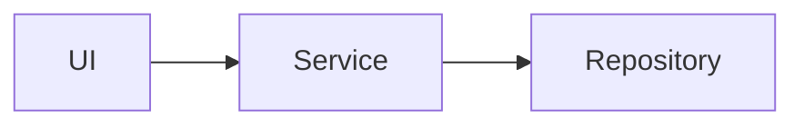

# Vending Machine

## Functional Requirements

### List all products
```
List all products in a table with columns
ID | NAME | PRICE | QUANTITY 
```

### Retrieve product by id
```
Input: ID, MONEY

Output:
  ID_NOT_FOUND
  NO_STOCK
  NOT_ENOUGH_MONEY
  SUCCESS ( change )
```

### Update products
```
Authorized User
Can update products: ID, NAME, PRICE, QUANTITY
```

### Get all money inside the machine
```
Input: Authorized User
```

### Analytics
```
Top 3 most brough products
Total Money
```

## Technical Documentation

### High Level Architecture



