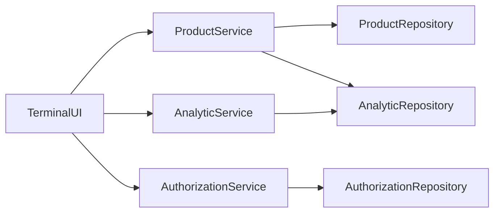
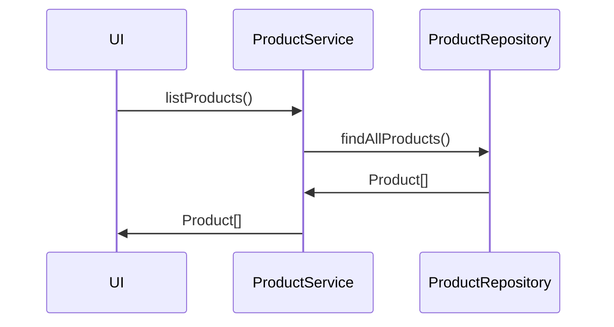
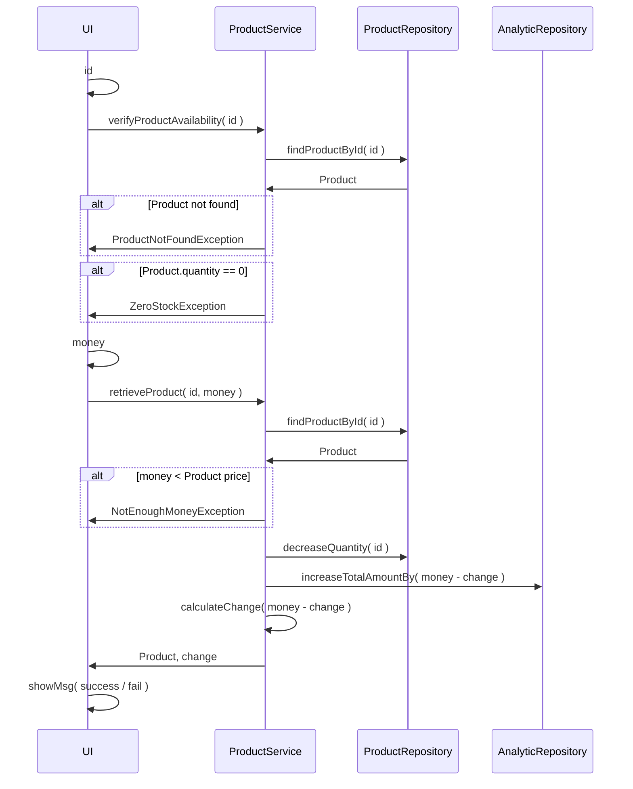
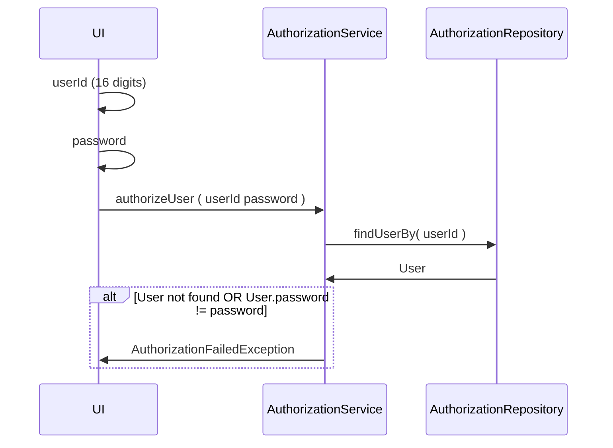
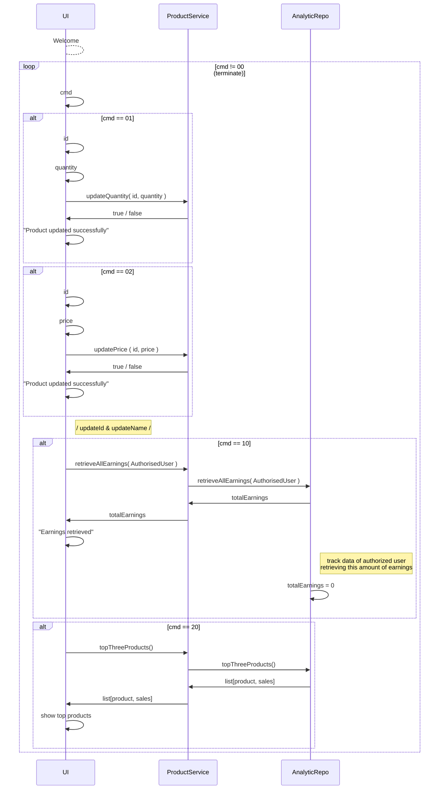

# Vending Machine

## Functional Requirements

### List all products
```
List all products in a table with columns
ID | NAME | PRICE | QUANTITY 
```

### Retrieve product
```
Input: ID, MONEY

Output:
  ID_NOT_FOUND
  NO_STOCK
  NOT_ENOUGH_MONEY
  SUCCESS ( change )
```

### Update products
```
*Authorized User
Can update products: ID, NAME, PRICE, QUANTITY
```

### Get all money inside the machine
```
Input: Authorized User, Command
```

### Analytics
```
Top 3 most brough products
Total Money
```

## Technical Documentation

### High Level Architecture


### List all products


### Retrieve product


### Update products

#### Step 1. Authorize


#### Command Table
| ID | ACTION                      |
|----|-----------------------------|
| 00 | exit()                      |
| 01 | updateQuantity()            |
| 02 | updatePrice()               |
| 03 | updateId()                  |
| 04 | updateName()                |
| 10 | addProduct()                |
| 20 | removeProduct()             |
| 30 | retreiveMoney               |
| 40 | topThreeMostSellingProducts |


#### Step 2.


## Commands



